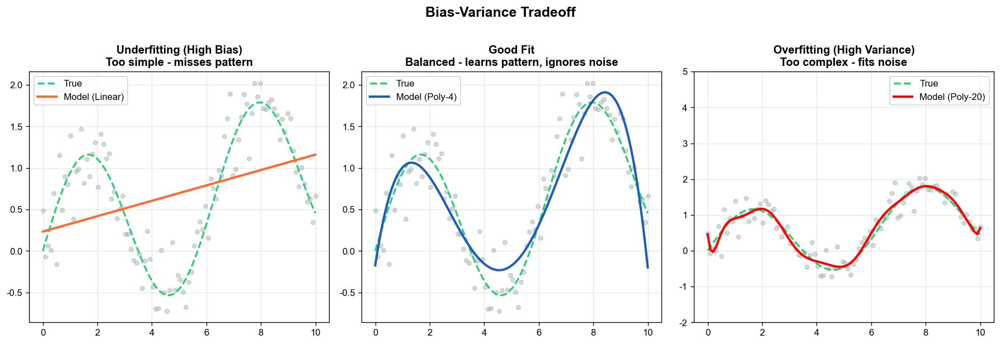
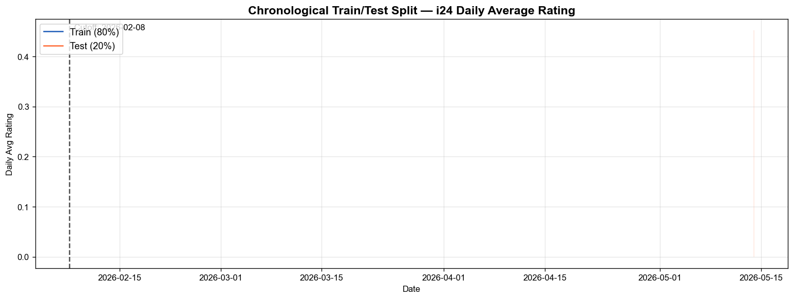
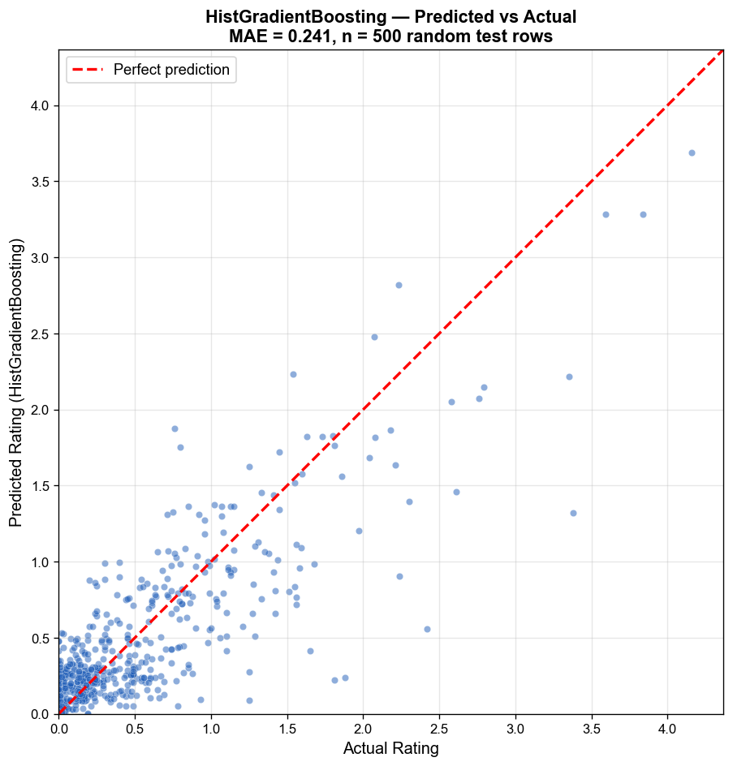
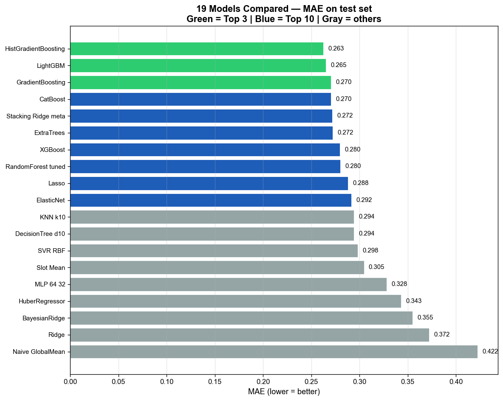
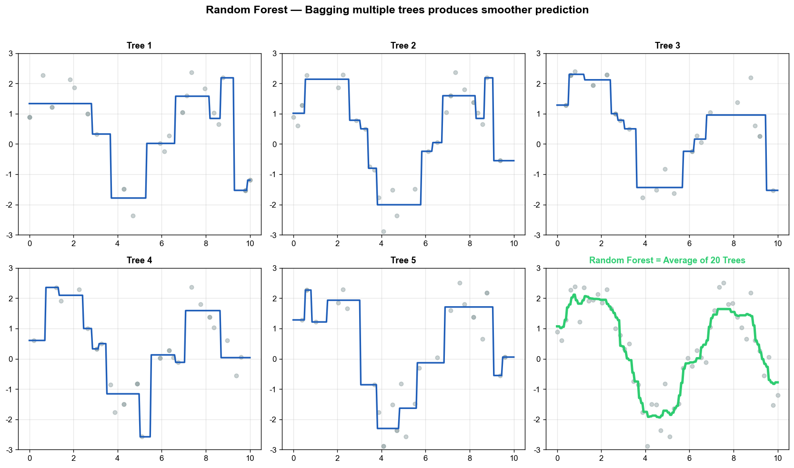
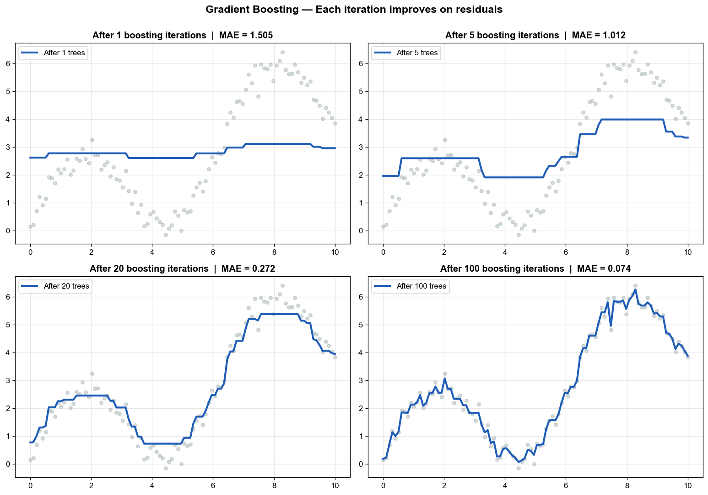
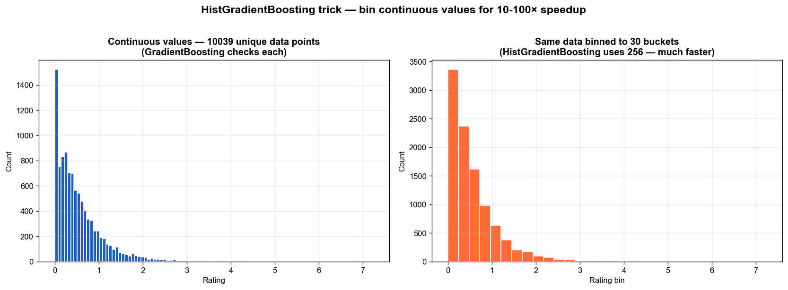
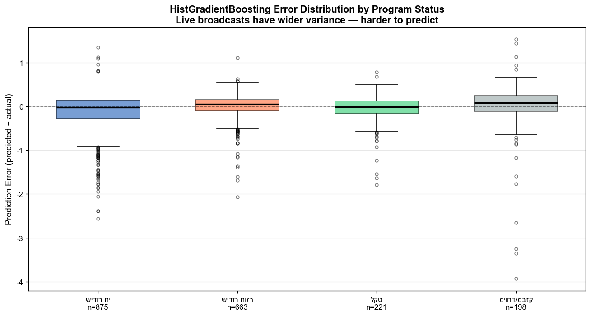

# 🎨 ויזואליזציה של אלגוריתמים — פרוייקט I24

*8 תרשימים שמסבירים אלגוריתמי ML, מבוססים על דאטה אמיתי מהפרוייקט.*
*נוצר ע"י `algo_visualizations.py`. תאריך: 2026-05-14.*

---

## 1. Bias-Variance Tradeoff

**מה רואים:** שלושה מודלים שונים מנסים ללמוד אותו דפוס. הקו הירוק = האמת. הנקודות = דגימות עם רעש.

- **שמאל (Underfitting):** קו ישר. המודל פשטני מדי, לא תופס את הגל. *Bias גבוה.*
- **אמצע (Good fit):** עקומה חלקה שעוקבת אחרי האמת. *מאוזן.*
- **ימין (Overfitting):** הקו מתפתל באופן פרוע — לומד גם את הרעש. *Variance גבוה.*

**איך זה רלוונטי לפרוייקט:**
- מודל **Naive** = underfitting קיצוני (ניחוש = ממוצע גלובלי).
- **DecisionTree** עמוק בלי tuning = overfitting (לומד בעל-פה את האימון).
- **HistGradientBoosting** עם `max_depth=6` ורגולריזציה = good fit.

---

## 2. Train/Test Split כרונולוגי

**מה רואים:** הרייטינג הממוצע ב-i24 על פני שנה. הקו הכחול = סט אימון (80%), הכתום = סט בחינה (20%). החיתוך ב-2026-02-08.

**למה כרונולוגי ולא רנדומלי?**
- בדאטה של זמן יש "מגמות" — הרייטינג עולה ויורד עם השנה.
- אם נחתוך רנדומלית, המודל "יראה" עתיד באימון. זה לא הוגן ולא מציאותי.
- כך אנחנו בודקים: *האם המודל יודע לחזות את **העתיד** מתוך **העבר**?*

**שימו לב:** ה-test set (כתום) דרמטית גבוה יותר מהאימון. זה drift אמיתי — *שאגת הארי* באוקטובר ואירועים נוספים העלו את הרייטינג.

---

## 3. Predicted vs Actual — HistGradientBoosting

**מה רואים:** כל נקודה היא תוכנית בודדת בסט הבחינה. ציר X = מה היה באמת, ציר Y = מה המודל ניבא.

**איך לקרוא:**
- **הקו האדום המקווקו** = חיזוי מושלם (תחזית = אמת).
- **נקודה מעל הקו** = ניבאנו גבוה מדי.
- **נקודה מתחת לקו** = ניבאנו נמוך מדי.
- **ככל שהנקודות קרובות לקו** = המודל מדויק.

**תובנה:** ב-rating נמוך (0.0-0.5) המודל מאוד מדויק — הנקודות צמודות לקו. ב-rating גבוה (1.5+) יש פיזור רחב יותר → המודל פחות בטוח. זה heteroscedasticity קלאסי.

---

## 4. Leaderboard של 19 מודלים

**מה רואים:** השוואת MAE של כל 19 המודלים שאומנו. ירוק = 3 הטופ, כחול = 10 הטופ, אפור = השאר.

**מסקנות:**
1. **HistGradientBoosting, LightGBM, CatBoost** מקובצים בראש — כולם משפחת Boosting מודרני, ההבדלים ביניהם ≤ 0.01 MAE.
2. **Naive (ממוצע גלובלי)** הוא הגרוע ביותר — צפוי.
3. **Slot Mean** (ממוצע רצועה) טוב יותר מ-Naive — הראיה שיש *signal* בעצם רישום הרצועה.
4. הפער מ-Slot Mean ל-HistGB = **הערך המוסף האמיתי של ML** בפרוייקט הזה.

---

## 5. Random Forest — כוח ההצבעה

**מה רואים:** 5 עצים בודדים (5 הראשונים) + עץ "ממוצע" (ימני-תחתון). כל עץ ראה רק חלק מהדאטה והגיב אחרת.

**איך RandomForest עובד:**
- כל עץ "פרוע" בפני עצמו (מקפיץ, רועש).
- כשמממצעים 20 עצים — האקראיות מתבטלת והקו מתחלק.
- *התוצאה:* יציבה יותר מכל עץ בודד. זה המשמעות של **ensemble**.

**הקבלה לפרוייקט:** Random Forest שלנו מורכב מ-300 עצים, כל אחד מאומן על דגימה אחרת של הדאטה. ה"חוכמת ההמון" שלהם נתנה MAE=0.280.

---

## 6. Gradient Boosting — לימוד שלב אחרי שלב

**מה רואים:** אותו דאטה, 4 שלבים של אימון Boosting:
- **1 עץ** = מודל פרימיטיבי, גס. MAE גבוה.
- **5 עצים** = משתפר.
- **20 עצים** = די מדויק.
- **100 עצים** = מצוין.

**איך זה עובד:**
- כל עץ חדש מסתכל על **מה העצים הקודמים פיספסו** ומתקן.
- בניגוד ל-RF (שכל העצים עובדים במקביל), כאן יש **שרשרת תיקונים**.
- זה גם החוזק וגם הסיכון: ככל שמוסיפים עצים → overfitting אם לא עוצרים בזמן.

**ב-HistGB שלנו:** עצרנו ב-100 עצים עם `early_stopping=True` שעוצר כשאין שיפור על validation.

---

## 7. Histogram Binning — הקסם של HistGradientBoosting

**מה רואים:**
- **שמאל:** רייטינג רציף, אלפי ערכים שונים. GradientBoosting רגיל בודק כל ערך → איטי.
- **ימין:** אותו דאטה מחולק ל-30 סלים. HistGB עובד עם 256 סלים, ובוחן רק את גבולות הסלים.

**ההשפעה:**
- **מהירות:** פי 10-100 מ-GradientBoosting קלאסי.
- **דיוק:** לא נפגע. למעשה — ה-binning עצמו פועל כמו **רגולריזציה**, מקטין overfitting.
- **זיכרון:** דורש פחות RAM.

**זו הסיבה ש-HistGB מומלץ ע"י sklearn ל-datasets גדולים, ולמה הוא ניצח בפרוייקט שלנו.**

---

## 8. שגיאות לפי סטטוס תוכנית (דאטה אמיתי)

**מה רואים:** התפלגות שגיאות החיזוי של HistGB, מפולחות לפי סטטוס תוכנית.

**הקריאה:**
- **קופסה** = 50% מהשגיאות (Q1 עד Q3).
- **קו אופקי** = חציון.
- **"שערוכים"** (whiskers) = רוב השגיאות.
- **נקודות חורגות** = שגיאות חריגות.

**מסקנות מהדאטה האמיתי:**
1. **"שידור חי"** — הקופסה הרחבה ביותר. תוכניות חיות (חדשות, קבינטים) שונות מאוד זו מזו → השונות גדולה.
2. **"שידור חוזר" / "לקט"** — קופסאות צרות יותר. דפוס צפוי יותר → המודל מדויק.
3. כל הקופסאות *מרכזיות סביב 0* → אין הטיה שיטתית.
4. ה-flier-ים (חריגים) למעלה ב"שידור חי" → השאגת הארי וכדומה.

**השלכה אופרטיבית:** באפליקציה, כשמשתמש מבקש חיזוי לתוכנית חיה, ה-CI חייב להיות רחב יותר. ב-`utils/predict.py` אכן יישמנו זאת.

---

## 🧠 סיכום: מה הוויזואליזציות מלמדות

| תרשים | תובנה מרכזית |
|---|---|
| 1 — Bias-Variance | הצורך באיזון: לא פשטני מדי, לא מורכב מדי. |
| 2 — Train/Test | חייבים פיצול כרונולוגי כדי שלא "לרגל" בעתיד. |
| 3 — Pred vs Actual | רייטינגים גבוהים = פחות מדויקים (heteroscedasticity). |
| 4 — Leaderboard | משפחת Boosting דוחפת את הגבול. ההפרשים בין HistGB/LGB/Cat קטנים. |
| 5 — RandomForest | "חוכמת ההמון" של עצים — ממוצע יציב. |
| 6 — Boosting | שרשרת תיקונים: כל עץ משלים את הקודמים. |
| 7 — Binning | ה-trick של HistGB: מהירות פי 10 בלי לאבד דיוק. |
| 8 — שגיאות פר סטטוס | שידור חי שונה משידור חוזר — אין מודל "אחד שמתאים לכולם". |

---

## 🔗 קישורים
- **קוד מקור:** `algo_visualizations.py`
- **דאטה:** `predictions_all.xlsx`, `תוכניות_מעובד.xlsx`
- **תרשימים:** `viz/01-08_*.png`
- **המשך קריאה:** `GLOSSARY.md` — הסבר כל מושג בנפרד.
