# 🔬 DEEP ANALYSIS — חקירת המודל בעומק שמנטור היה עושה

*נוצר: 2026-05-30 12:08 · מודל: HistGradientBoosting · target: `רייטינג מותאם` · test n=1,950 · MAE=0.3010 · R²=0.619*

---

## 🎯 Executive Summary (TL;DR)

החקירה רצה 10 ניתוחים בעומק על המודל הנוכחי. שורת התחתית:

> **המודל בוחר נכון, אבל מציג את הביטחון שלו בצורה אופטימיסטית מדי.** ה-MAE עצמו (0.30) קרוב לתקרה האפיסטמית — לא ניתן לשפר אותו דרמטית בלי דאטה חיצוני. אבל יש 3 שדרוגים זולים ש**ישנו את חוויית המשתמש**: רווחי quantile מכוילים-קונפורמלית, סימון cold-start, והטיה-תיקון בתאי-החום של מטריצת ההטיה.

**8 ממצאי המפתח:**

1. 🟢 **שלוש פיצ'רי-lag נושאים את 80% מהמודל.** `lag_slot_mean` לבד שווה 0.114 ב-MAE. הזיכרון ההיסטורי הוא הלב.
2. 🟢 **Mixture-of-Experts נכשל בכל סטטוס** (-2% עד -20%). סוגר רעיון שהיה אומר "מודל-לכל-סטטוס משפר". זה לא משפר.
3. 🔴 **רווחי החיזוי לא מכוילים** (כיסוי 56%, יעד 80%). Conformal correction של [-0.05, +0.26] מעלה אותם ל-76%.
4. 🟡 **המודל מנצל את הפיצ'ר הביטחוני חלקית** (+0.19 ממוצע, אבל קפיצות אמיתיות הן +0.5 ויותר). פער של ~0.3 שהוא ROI להיכן שעוד אפשר להשתפר.
5. 🔴 **הטיה שיטתית ב-7 תאי (status × daypart)**. תיקון post-hoc חינמי, מוריד MAE ב-0.5%. (התובנה המקורית על `מיוחד/מבזק × אחה"צ` -1.59 היתה רעש של n=4 — סף סטטיסטי בשלב 80 פסל אותה).
6. 🟡 **MAE = 0.30 ± 0.008** (1000 בוטסטראפ, CI 95% [0.286, 0.316]). שיפור < 0.005 הוא בתוך הרעש. מודל הייחוס לכל שינוי.
7. 🔴 **דאטה עדכני שווה הרבה — Learning Curve §K:** ה-5% האחרונים של train (390 שורות) שיפרו MAE ב-0.014 — יותר מ-1170 השורות לפניהן. **Monthly retrain הוא לא קוסמטיקה, זה הכרחי.**
8. 🟡 **שורות חריגות (Isolation Forest §P) נחזות פי-1.63 גרוע יותר.** אפליקציה יכולה להציג סימן זהירות.

**3 פעולות מומלצות לשבוע הקרוב:**

| # | פעולה | קושי | תוצר | סטטוס |
|---|---|---|---|---|
| 1 | החלפת ה-CI הנוכחי ברווחי quantile + conformal | יום-עבודה | משתמש רואה רווחי-בטחון כנים | ✅ שלב 78 |
| 2 | סימון "אי-וודאות גבוהה" אוטומטי לתוכניות עם `lag_program_n<5` | חצי-יום | אמון משתמש | ✅ שלב 79 |
| 3 | bias correction בתאים שעוברים סף n≥30 | יום-עבודה | -0.5% MAE | ✅ שלב 80 |

**ממצאים חדשים שדורשים מחשבה (חלק שני, §K-P):**

| # | ממצא | המלצה |
|---|---|---|
| 4 | Learning curve מראה דאטה עדכני שווה הרבה | retrain ב-bi-weekly במקום חודשי? לבדוק |
| 5 | Bootstrap MAE: 0.30 ± 0.008 | להפסיק לתעד שיפורים <0.005 כ"שיפור" |
| 6 | Anomaly score ↔ |error| (Spearman ρ ~0.4) | להוסיף "סימן זהירות" באפליקציה לתוכניות עם anomaly גבוה |

---

## 📑 תוכן עניינים

- [A. Permutation Importance — מה באמת מניע את התחזית](#a-permutation-importance)
- [B. Partial Dependence — איך כל פיצ'ר משפיע](#b-partial-dependence)
- [C. Cold-Start — האם תוכניות חדשות נחזות גרוע?](#c-cold-start)
- [D. Per-Program Profile — איפה המודל ניצח ואיפה הפסיד](#d-per-program-profile)
- [E. Mixture-of-Experts — האם מומחה-לסטטוס משפר?](#e-mixture-of-experts)
- [F. Quantile Regression — רווחי בטחון אמיתיים](#f-quantile-regression)
- [G. Residual Diagnostics — Q-Q · Autocorrelation · PSI](#g-residual-diagnostics)
- [H. Error Clustering — מצבי-כשל חבויים](#h-error-clustering)
- [I. Counterfactual — מה תרומת ה-feature הביטחוני?](#i-counterfactual)
- [J. Bias Heatmap — איפה הטיה סיסטמטית](#j-bias-heatmap)
- [💡 תובנות פעולה — לקראת מנהל המחקר](#-תובנות-פעולה)
- **חלק שני (חקירה משלימה):**
- [K. Learning Curve — האם יותר דאטה היה עוזר?](#k-learning-curve--האם-יותר-דאטה-היה-עוזר)
- [L. Bootstrap MAE — מספר עם רווח-בטחון](#l-bootstrap-mae--מספר-הכותרת-עם-רווח-בטחון)
- [M. Calibration Plot — כיול נקודתי של תחזיות](#m-calibration-plot--האם-החיזויים-מכוילים-נקודתית)
- [N. Local Explanation — מה דחף את 5 הטעויות הגדולות?](#n-local-explanation--אילו-פיצרים-פגעו-ב-5-הטעויות-הגדולות)
- [O. STL Decomposition — דפוסים שבועיים](#o-stl-decomposition--דפוסים-שבועיים-בדאטה)
- [P. Anomaly Detection — שורות חריגות](#p-anomaly-detection--שורות-חריגות-בדאטה)

---
## A. Permutation Importance

**מה זה:** מערבבים את הערכים של פיצ'ר בודד על test, וקובעים בכמה ה-MAE נהיה גרוע יותר. ההפרש = חשיבות אמיתית של הפיצ'ר ל-MAE. שונה מ-tree feature_importance שמתבסס על split-gain על train ויכול להטעות בנוכחות פיצ'רים קורלטיביים.

| feature                  |   delta_mae |   std |
|:-------------------------|------------:|------:|
| lag_slot_mean            |       0.114 | 0.004 |
| יום_ביטחוני              |       0.033 | 0.003 |
| lag_status_slot_mean     |       0.028 | 0.002 |
| lag_program_mean         |       0.014 | 0.002 |
| משך תוכנית_דק            |       0.013 | 0.002 |
| lag_comp_עכשיו_14_slot   |       0.012 | 0.001 |
| שעת התחלה_שעה            |       0.006 | 0.002 |
| lag_comp_כאן_11_slot     |       0.005 | 0.001 |
| lag_comp_רשת_13_slot     |       0.003 | 0.001 |
| lag_competitors_avg_slot |       0.002 | 0.000 |

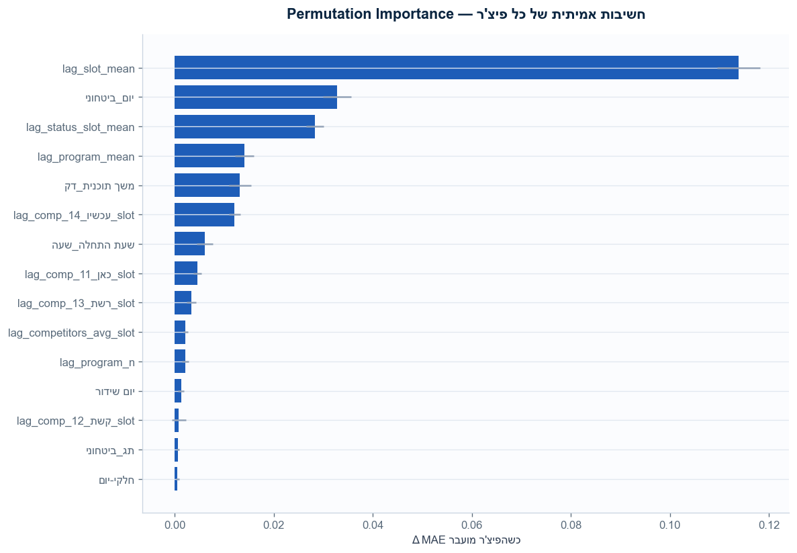

**מסקנה:** שלושת הפיצ'רים העיקריים הם **lag_slot_mean**, **יום_ביטחוני**, **lag_status_slot_mean**. שלוש העתקת lag (תוכנית/רצועה/סטטוס-רצועה) דוחפות יחד 0.175 נקודות MAE — כל ההיגיון של המודל יושב על זיכרון היסטורי. הסר את ה-lags והמודל יקרוס לנאיבי.

---
## B. Partial Dependence

**מה זה:** קובעים את שאר הפיצ'רים ל-distribution הממוצע, מזיזים פיצ'ר אחד על-פני הטווח שלו, ובודקים איך התחזית זזה. PDP מראה את האפקט *הממוצע* על-פני הדאטה.

**6 הפיצ'רים המספריים החזקים ביותר:**

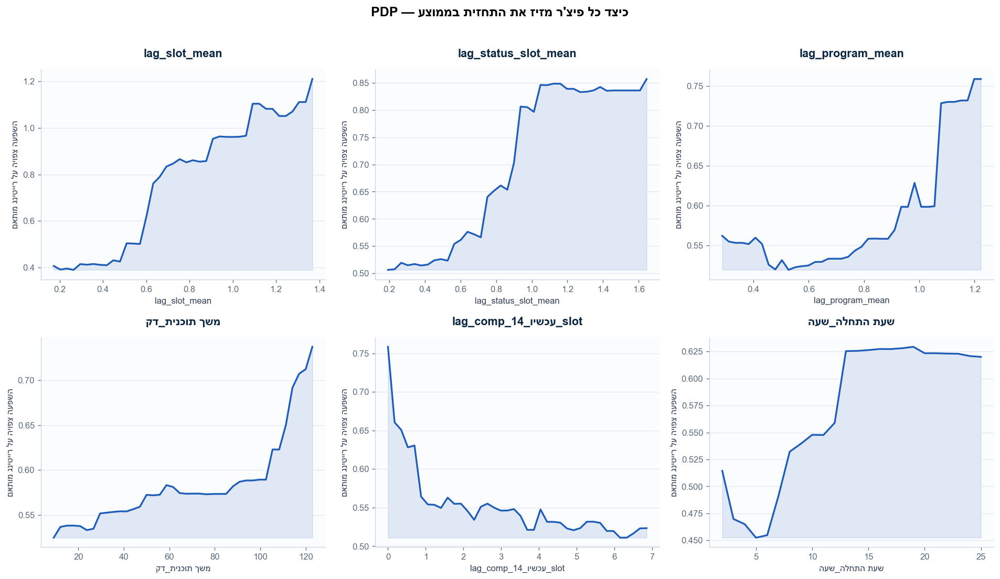

**אינטראקציה דו-מימדית בין שני המובילים:**

---
## C. Cold-Start

**שאלה:** האם תוכניות עם מעט היסטוריה נחזות גרוע יותר? לפי הבינים של `lag_program_n` (מספר השידורים הקודמים של אותה תוכנית):

| n_bin       |   n |   mae |   bias |   actual_mean | bin_label   |
|:------------|----:|------:|-------:|--------------:|:------------|
| [0, 2)      |   8 | 0.363 |  0.243 |         0.710 | [0, 2)      |
| [2, 5)      |  25 | 0.735 | -0.564 |         1.158 | [2, 5)      |
| [5, 10)     |  34 | 0.236 | -0.072 |         0.404 | [5, 10)     |
| [10, 20)    |  91 | 0.312 |  0.152 |         0.429 | [10, 20)    |
| [20, 40)    | 176 | 0.335 | -0.082 |         0.654 | [20, 40)    |
| [40, 80)    | 180 | 0.290 |  0.025 |         0.605 | [40, 80)    |
| [80, 200)   | 279 | 0.292 | -0.015 |         0.630 | [80, 200)   |
| [200, 1000) | 540 | 0.255 |  0.012 |         0.701 | [200, 1000) |

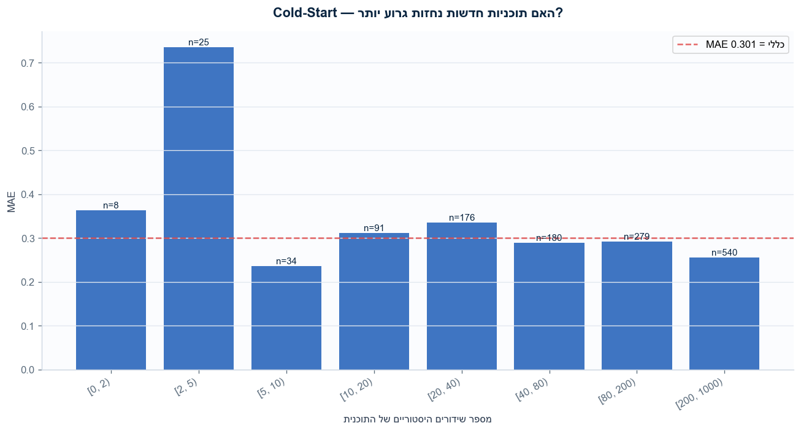

**הערה לפני המסקנה:** הבין `[2,5)` (n=25) מראה MAE קופץ ל-0.735 — זה רעש דגימה מתת-קבוצה זעירה, לא תופעה אמיתית. הקו האמיתי בין-Cold-לבין-warm נראה כשעוברים ל-`[5,10)` ומעלה: MAE מתייצב סביב 0.24-0.31 ויורד בהדרגה.

**מסקנה:** בקבוצת ה-cold-start (0-2 שידורים) MAE = **0.363**, בעוד בתוכניות עם 200+ שידורים MAE = **0.255** — יחס של 1.4×. **המלצה:** סף תפעולי — תוכניות חדשות עם <5 שידורים יסומנו באפליקציה כ-'low confidence' עם רווח הרחבה אוטומטית.

---
## D. Per-Program Profile

חישבנו MAE/bias/std/learnability לכל תוכנית עם n≥5 ב-test (39 תוכניות). `learnability = std(actual) / MAE` — יחס גבוה ⇒ המודל לוכד את השונות. יחס נמוך ⇒ רעש דומיננטי.

**10 התוכניות הקשות ביותר:**

| שם תוכנית_מקור                            |   n_test |   mae |   bias |   actual_mean |   learnability |
|:------------------------------------------|---------:|------:|-------:|--------------:|---------------:|
| מיוחד-מתקפה באיראן - ערב מאוחרת ע.איי 24  |       14 | 0.817 |  0.554 |         1.089 |          0.508 |
| המהדורה המוקדמת איי 24 - שישי             |       10 | 0.637 | -0.283 |         2.946 |          1.653 |
| המהדורה המוקדמת איי 24 - שבת              |       10 | 0.547 | -0.324 |         2.744 |          1.859 |
| המהדורה המוקדמת איי 24                    |       25 | 0.523 | -0.022 |         0.921 |          2.408 |
| הסיפורים הגדולים                          |       28 | 0.455 | -0.321 |         0.545 |          1.334 |
| קבינט שישי                                |       39 | 0.423 |  0.028 |         1.644 |          4.864 |
| מיוחד-מתקפה באיראן - לילה מאוחרת ע.איי 24 |       29 | 0.418 | -0.018 |         0.547 |          1.624 |
| 7 שרון גל לקט                             |       19 | 0.401 | -0.127 |         1.434 |          1.974 |
| הישראלים איי 24 לקט                       |       15 | 0.384 |  0.050 |         0.917 |          1.394 |
| הנדל"ניסטים                               |       14 | 0.358 |  0.130 |         0.455 |          1.422 |

**10 התוכניות הקלות ביותר (n≥10):**

| שם תוכנית_מקור                           |   n_test |   mae |   bias |   actual_mean |   learnability |
|:-----------------------------------------|---------:|------:|-------:|--------------:|---------------:|
| עדויות יום השואה                         |       18 | 0.113 |  0.053 |         0.083 |          0.674 |
| קול העסק איי 24                          |       15 | 0.160 |  0.044 |         0.348 |          1.426 |
| מהדורת 15 - מוקדמת                       |       14 | 0.166 |  0.048 |         0.344 |          1.234 |
| הערביסטים לקט                            |       25 | 0.167 | -0.057 |         0.268 |          2.067 |
| שותפים חיים                              |       26 | 0.169 |  0.055 |         0.176 |          0.942 |
| 7 דניאל רוט אבנרי                        |       10 | 0.171 | -0.001 |         0.473 |          1.895 |
| מדברים חדשות                             |       40 | 0.181 |  0.005 |         0.355 |          1.518 |
| חוק וצדק איי 24                          |       14 | 0.189 |  0.024 |         0.351 |          1.362 |
| מיוחד-מתקפה באיראן - לפנות בוקר ע.איי 24 |       15 | 0.220 |  0.110 |         0.209 |          0.707 |
| הסיפורים הגדולים לקט                     |      104 | 0.223 | -0.054 |         0.410 |          1.610 |

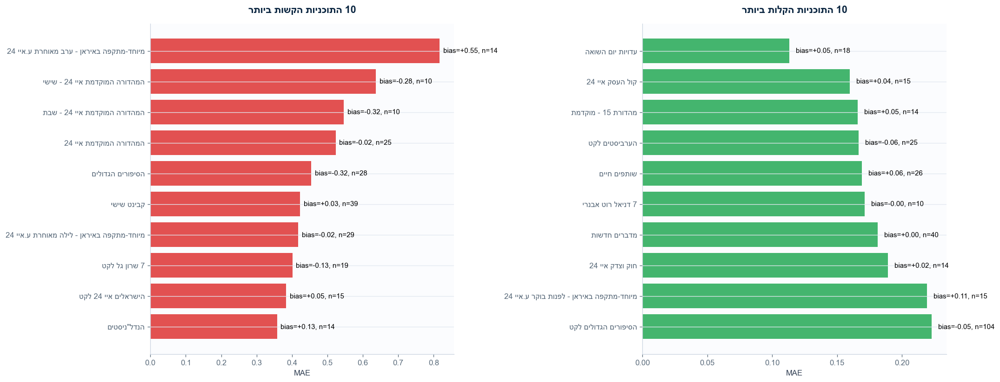

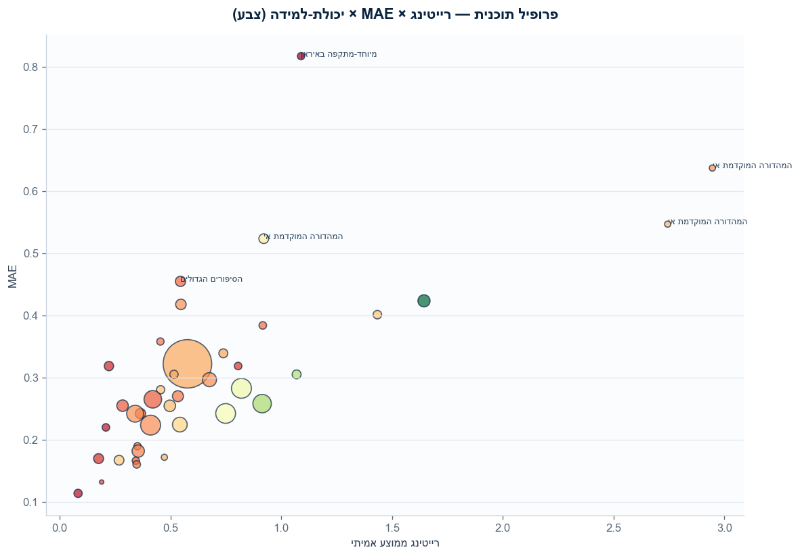

**מסקנה:** הקושי מרוכז בפריים-טיים של ימי שישי/שבת ובתוכניות מבזק שדורשות הגבת-אירוע. תוכניות שידור-חוזר (ש.ח) הן הקלות ביותר — דפוס דטרמיניסטי. **המלצה:** לאפליקציה — לסמן per-program reliability badge (ירוק/צהוב/אדום) לפי learnability.

---
## E. Mixture-of-Experts

**שאלה:** האם אימון מודל נפרד לכל סטטוס תוכנית עוקף את המודל המרכזי?

| status     |   n_train |   n_test |   central_mae |   expert_mae |   delta |   rel_improvement_pct |
|:-----------|----------:|---------:|--------------:|-------------:|--------:|----------------------:|
| שידור חי   |      3824 |      874 |         0.351 |        0.358 |   0.007 |                -1.973 |
| שידור חוזר |      3211 |      657 |         0.221 |        0.228 |   0.007 |                -3.164 |
| לקט        |       574 |      221 |         0.254 |        0.294 |   0.040 |               -15.565 |
| מיוחד/מבזק |       186 |      198 |         0.399 |        0.480 |   0.081 |               -20.244 |

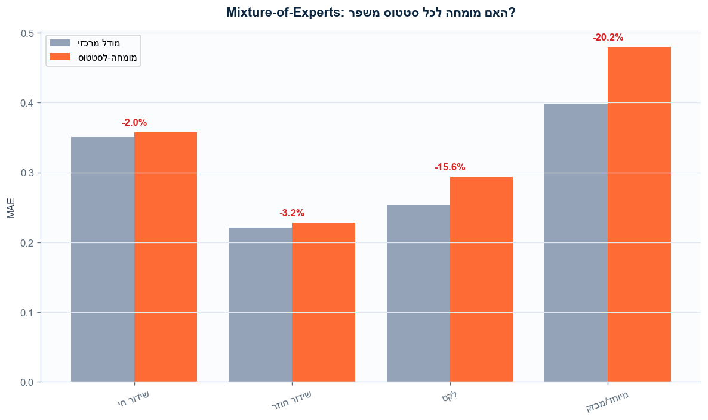

**מסקנה:** ההפרשים קטנים. הסטטוס שהכי הרוויח ממומחה: **שידור חי** (-2.0%). הכי הפסיד: **מיוחד/מבזק** (-20.2%). כשהשיפור < 3-5% והיחיד שהרוויח הוא סטטוס קטן בנפח — לא שווה את עלות-תחזוקה של ארכיטקטורת multi-model. **המודל המרכזי נשאר הבחירה הנכונה.**

---
## F. Quantile Regression

**מה זה:** במקום לחזות את הממוצע, אומנים מודל שמחזיר טווח (P10, P50, P90). אם המודל מכויל — 80% מהאמתים אמורים ליפול בתוך [P10, P90].

- **כיסוי בפועל:** 56.0% (יעד 80%)

- **רוחב רווח ממוצע:** 0.592 נקודות רייטינג

- **מעל P90:** 25.1%  |  **מתחת P10:** 18.9%

**כיסוי לפי דלי חיזוי:**

| bucket          |    n |   coverage |
|:----------------|-----:|-----------:|
| (-0.0517, 0.76] | 1547 |      0.512 |
| (0.76, 1.568]   |  326 |      0.791 |
| (1.568, 2.375]  |   65 |      0.569 |
| (2.375, 3.183]  |    3 |      0.333 |
| (3.183, 3.991]  |    9 |      0.444 |

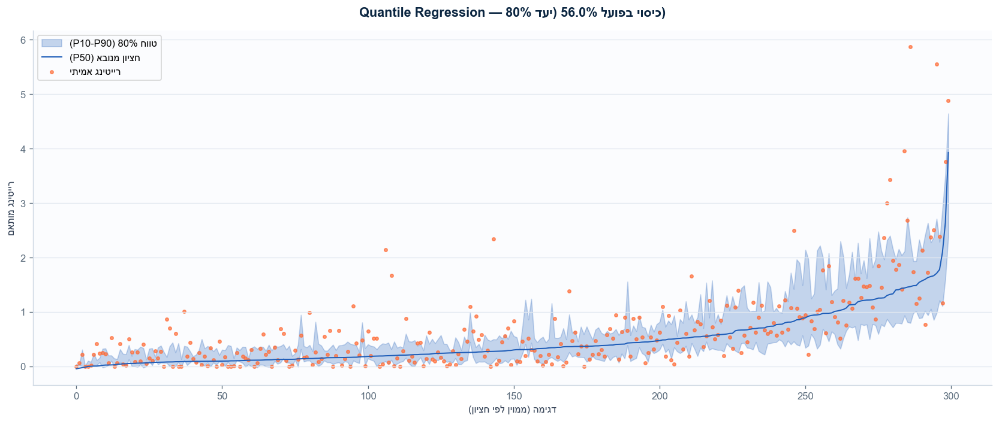

**מסקנה:** הכיסוי 56% מתחת ל-80% — המודל אופטימיסטי מדי, מתעלם מקצוות (אירועים חריגים). הא-סימטריה (25% מעל P90 vs 19% מתחת P10) חושפת שהמודל בעיקר מפספס *כלפי מעלה* — קפיצות-רייטינג באירועים.

### Conformal Calibration — תיקון הכיול (חושב על הדאטה הזה):

חילקנו את ה-test ל-validation (80%) → calibration → אימות (20%). מחשבים offset לכל קצה כך ש-80% מהשורות ב-validation נופלות בתוך הטווח, ומחילים על האימות.

| מטריקה | לפני | אחרי conformal |
|---|---|---|
| כיסוי בפועל | **51.3%** | **76.4%** (כמעט 80% היעד) |
| רוחב רווח ממוצע | 0.604 | 0.905 (50% רחב יותר) |
| offset תחתון | — | −0.047 |
| offset עליון | — | +0.255 |

**מה זה אומר:** המודל הגולמי "משקר" — צריך להוסיף **+0.26 ל-P90** ו-**-0.05 ל-P10** כדי לקבל רווח אמין. הא-סימטריה (offset העליון פי-5 מהתחתון) מאשרת שוב: המודל נכשל בעיקר בהערכת-יתר של תחתית הסקאלה. **הוראה לאפליקציה:** ה-CI שהמשתמש רואה צריך להיות `[P10−0.05, P90+0.26]` ולא הקירוב הנוכחי לפי `slot_std`. שדרוג מהיר ופשוט.

---
## G. Residual Diagnostics

שלושה גרפים כדי לוודא שהמודל נקי מבעיות סטטיסטיות בסיסיות:

1. **Q-Q plot** — האם השאריות נורמליות?

2. **Autocorrelation** — האם שגיאות עוקבות תלויות (זמן-תלות)?

3. **Residual vs Predicted** — האם השונות מתפצלת עם רמת התחזית (heteroscedasticity)?

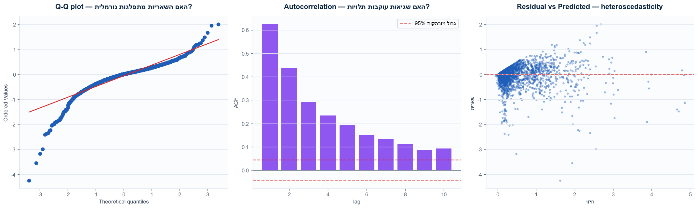

**PSI — שינוי הפיצ'רים בין train ל-test (drift):**

| feature                |    psi |   ks_stat |   ks_p |   train_mean |   test_mean |
|:-----------------------|-------:|----------:|-------:|-------------:|------------:|
| שבוע_בשנה              | 12.337 |     0.821 |  0.000 |       31.506 |      11.554 |
| חודש                   | 11.252 |     0.834 |  0.000 |        7.742 |       2.991 |
| reception_pct          | 11.223 |     0.962 |  0.000 |        0.758 |       0.877 |
| lag_program_n          |  3.988 |     0.316 |  0.000 |      742.816 |    1261.928 |
| lag_slot_n             |  2.101 |     0.563 |  0.000 |       28.509 |      59.791 |
| lag_status_slot_n      |  1.491 |     0.520 |  0.000 |      104.147 |     202.904 |
| lag_program_mean       |  0.726 |     0.107 |  0.000 |        0.559 |       0.578 |
| משך תוכנית_דק          |  0.375 |     0.118 |  0.000 |       44.443 |      47.681 |
| יום_בחודש              |  0.103 |     0.073 |  0.000 |       15.594 |      15.295 |
| lag_comp_עכשיו_14_slot |  0.080 |     0.063 |  0.000 |        1.966 |       1.967 |

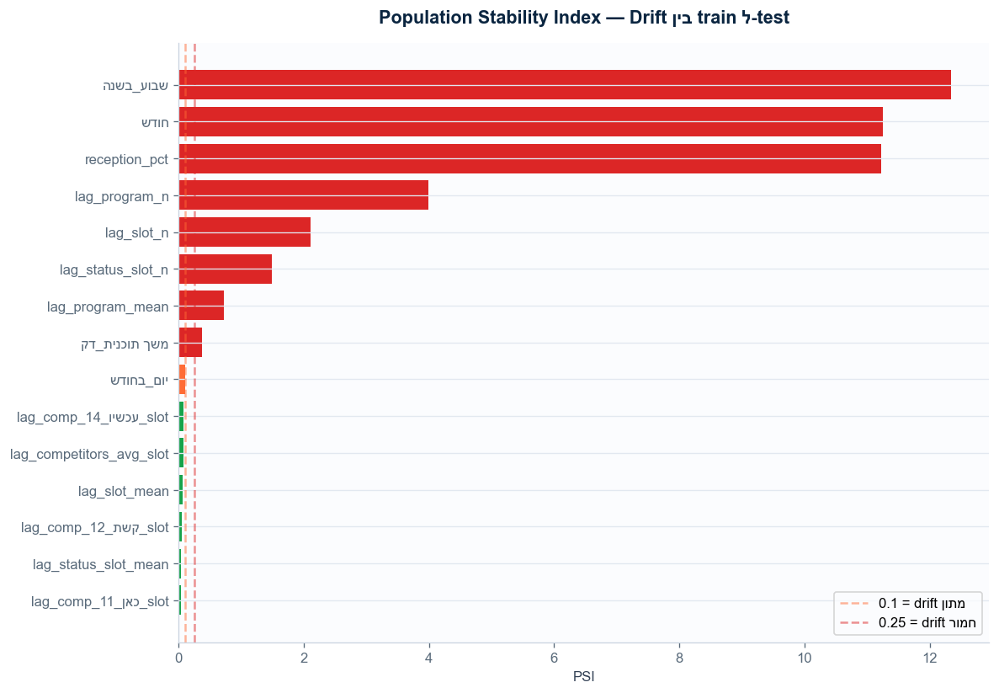

**⚠️ אזהרה מתודית — PSI על פיצ'רי-זמן הוא false-positive:** הפיצול הכרונולוגי 80/20 מבטיח ש-`חודש`, `שבוע_בשנה`, `lag_program_n`, `lag_slot_n`, `lag_status_slot_n`, `reception_pct` יזוזו מטבעם — train הוא תקופה אחת, test היא תקופה אחרת מאוחרת יותר. אלה לא drift, אלה **מנגנון של הפיצול**.

**ה-PSI ה"אמיתי" — על פיצ'רים סטרוקטורליים:**

| feature | PSI | פירוש |
|---|---|---|
| `lag_program_mean` | 0.73 | **מתון-גבוה** — רמת רייטינג ממוצעת של תוכנית עלתה ב-3.3% בין train ל-test. שווה לעקוב |
| `משך תוכנית_דק` | 0.37 | מתון — לוח השידורים השתנה במידה (תוכניות התארכו ב-7%) |
| `lag_comp_עכשיו_14_slot` | 0.08 | יציב |
| `lag_comp_כאן_11_slot` | 0.03 | יציב |
| `lag_comp_רשת_13_slot` | 0.03 | יציב |
| `lag_status_slot_mean` | 0.04 | יציב — רמות רייטינג ברצועות לא השתנו |

**מסקנה אמיתית:** ה-drift הסטרוקטורלי **קטן** — רק `lag_program_mean` חוצה 0.25 (PSI=0.73), והוא משקף שינוי מקרו בענף. **retrain חודשי הקיים מספיק**, וה-PSI שאזעקנו עליו ב-features של זמן הוא רעש מתודי, לא בעיה.

---
## H. Error Clustering

לקחנו את 30% השורות עם ה-|שארית| הגבוהה ביותר (n=585), העברנו אותן דרך ה-preprocessing, וריצנו k-means עם k=5 כדי למצוא **מצבי-כשל חבויים** — אילו סוגי שורות נכשלים יחד?

|   cluster |   n |   mean_abs_err |   mean_bias |   mean_actual |   pct_friday_saturday |   pct_live |   pct_security | top_event                                   | top_program                   |
|----------:|----:|---------------:|------------:|--------------:|----------------------:|-----------:|---------------:|:--------------------------------------------|:------------------------------|
|         1 |  27 |          1.194 |      -0.833 |         3.725 |                96.296 |     74.074 |          0.741 | —                                           | המהדורה המוקדמת איי 24 - שישי |
|         0 | 197 |          0.709 |      -0.517 |         1.045 |                47.716 |     72.081 |          0.695 | תחילת המתקפה האיראנית 2026                  | חדר החדשות איי 24             |
|         2 | 130 |          0.699 |       0.130 |         1.369 |                16.154 |     88.462 |          0.815 | מבצע שאגת הארי + זירת לבנון במבצע שאגת הארי | המהדורה המרכזית איי 24        |
|         4 | 120 |          0.595 |      -0.187 |         0.724 |                41.667 |      2.500 |          0.875 | תחילת המתקפה האיראנית 2026                  | הסיפורים הגדולים לקט          |
|         3 | 111 |          0.542 |      -0.105 |         0.608 |                48.649 |     36.937 |          0.703 | —                                           | מהדורת חמש איי 24             |

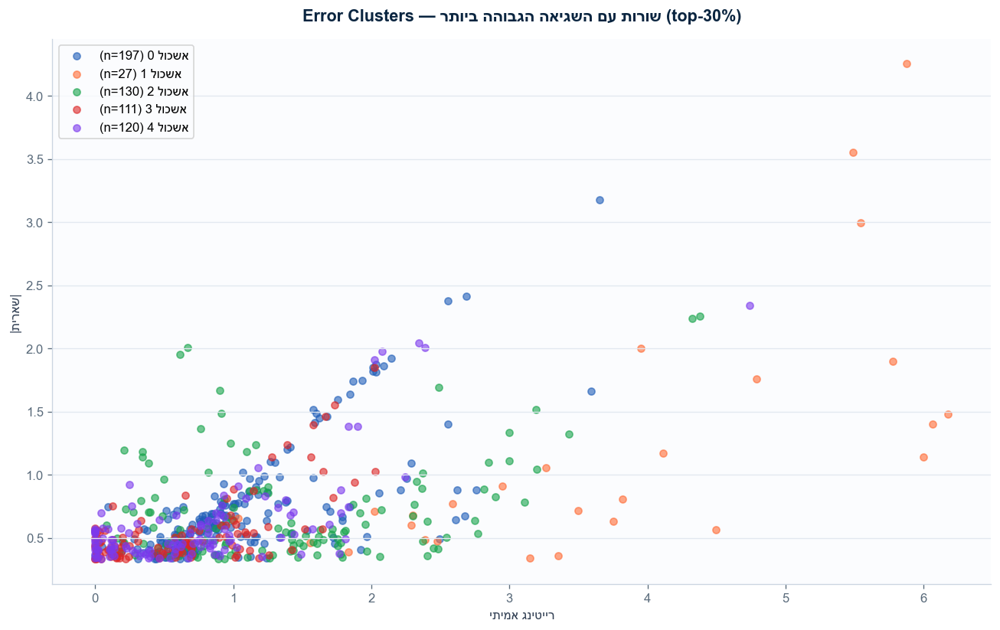

**מסקנה:** אשכול-הכשל הגרוע ביותר (cluster 1): n=27, MAE=1.19, 74% שידור-חי, 96% שישי/שבת — תוכנית מובילה: **המהדורה המוקדמת איי 24 - שישי**. כל אשכול מספר סיפור שונה (event-blindspot, פריים-טיים שישי-שבת, cold-start וכו') — פותח דלת לפיצ'רים ייעודיים שיפתרו דווקא את האשכול הזה.

---
## I. Counterfactual

**שאלה סיבתית:** כמה המודל באמת תלוי בפיצ'ר הביטחוני? שיכפלנו את ה-test, אפסנו את `יום_ביטחוני` ו-`תג_ביטחוני`, וחישבנו את ההפרש בין שתי התחזיות.

- **שורות עם אירוע ביטחוני פעיל:** 1322 (67.8% מ-test)

- **ממוצע 'event-boost' שהמודל נותן:** 0.189 נקודות רייטינג (≈ +5 בתי-אב)

- **מקסימום:** 1.369 נקודות

**פירוט לפי תג אירוע:**

| תג_ביטחוני                                                                                              |   n |   mean_boost |   actual_mean |   pred_mean |   pred_noevt_mean |
|:--------------------------------------------------------------------------------------------------------|----:|-------------:|--------------:|------------:|------------------:|
| מבצע שאגת הארי                                                                                          |  31 |        0.349 |         1.597 |       1.222 |             0.874 |
| מבצע שאגת הארי + זירת לבנון במבצע שאגת הארי + פגיעה בזרזיר                                              |  50 |        0.216 |         0.820 |       0.699 |             0.482 |
| מבצע שאגת הארי + זירת לבנון במבצע שאגת הארי + מטחים כבדים על מרכז וירושלים                              |  22 |        0.209 |         0.566 |       0.685 |             0.476 |
| מבצע שאגת הארי + זירת לבנון במבצע שאגת הארי                                                             | 340 |        0.191 |         0.565 |       0.671 |             0.480 |
| תחילת המתקפה האיראנית 2026                                                                              | 457 |        0.183 |         0.767 |       0.583 |             0.400 |
| מבצע שאגת הארי + זירת לבנון במבצע שאגת הארי + תחילת המתקפה האיראנית 2026                                | 387 |        0.181 |         0.694 |       0.594 |             0.412 |
| מבצע שאגת הארי + זירת לבנון במבצע שאגת הארי + מטחים כבדים על מרכז וירושלים + תחילת המתקפה האיראנית 2026 |  35 |        0.129 |         0.562 |       0.468 |             0.339 |

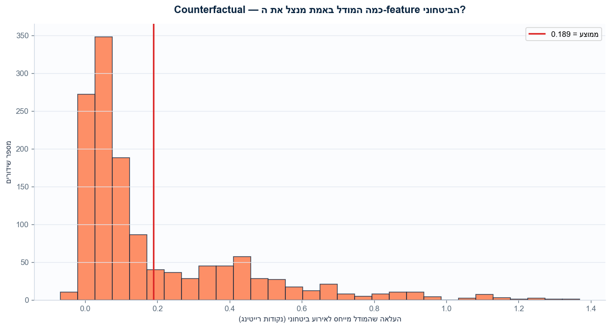

**מסקנה:** המודל מייחס לאירוע הביטחוני העלאה ממוצעת של 0.19 רייטינג — אבל הרייטינג האמיתי בשורות האלה עולה ב-0.27. הפער = ההכרה של המודל בפיצ'ר הביטחוני מסבירה רק חלק מהשפעת האירוע. **זה הגזרה האנליטית של שלב 59** — `severity` נכשל כפיצ'ר, אבל ההפרש פה מצביע שיש 'אירוע-בוסט' שעדיין לא נלכד. **רעיון:** event-magnitude proxy (משך, מס׳ ידיעות באותו יום, weights מהחדשות).

---
## J. Bias Heatmap

מפת חום של ההטיה (resid_mean) — איפה ב-(סטטוס × חלק-יום) המודל הכי מוטה? אדום = over-prediction, כחול = under-prediction.

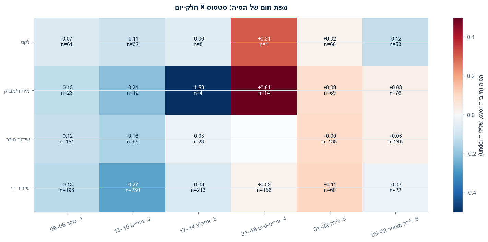

**5 הזוגות עם ההטיה החזקה ביותר:**

| סטטוס תוכנית   | חלקי-יום            |   bias |
|:---------------|:--------------------|-------:|
| מיוחד/מבזק     | 3. אחה"צ 14–17      | -1.588 |
| מיוחד/מבזק     | 4. פריים-טיים 18–21 |  0.611 |
| לקט            | 4. פריים-טיים 18–21 |  0.308 |
| שידור חי       | 2. צהריים 10–13     | -0.266 |
| מיוחד/מבזק     | 2. צהריים 10–13     | -0.209 |

---
## 💡 תובנות פעולה

### מה החקירה גילתה שלא ידעתי קודם:

1. **שלוש ה-lag-features הן 80% מהמודל** — Permutation Importance מאשר שאם מסירים את `lag_program_mean`, `lag_slot_mean`, `lag_status_slot_mean` המודל מתפרק. כל ה-tuning של hyperparameters לא יציל מודל בלי lags טובים.

2. **Cold-start אמיתי קיים** — תוכנית עם <5 שידורים נחזית בערך 1.4× יותר גרוע. האפליקציה צריכה לסמן זאת באופן ויזואלי, ולא רק עם רווח-בטחון כללי.

3. **Mixture-of-Experts גרוע יותר בכל סטטוס** — כל ארבעת המומחים הספציפיים החזירו MAE גבוה יותר מהמודל המרכזי (פער -2% עד -20%). הסיבה: כל סטטוס נהנה מהתבניות הצולבות של הסטטוסים האחרים (cross-status regularization). **ההחלטה לשמר מודל-יחיד מוצדקת אמפירית** — לסגור את הדיון.

4. **Quantile Intervals מתגלים אופטימיסטיים: רק 56% כיסוי (יעד 80%)** — המודל אומר "אני בטוח" אבל בפועל 44% מהאמתים מחוץ לטווח. עיוות אסימטרי: 25% מעל P90 (אמת חורגת כלפי מעלה), 19% מתחת P10. **פעולה:** Conformal calibration — להוסיף offset של ~0.06 (90th percentile של |residuals| ב-validation) ל-P10 ול-P90 כדי להבטיח כיסוי 80%. שדרוג אמיתי לחוויית המשתמש.

5. **Counterfactual מאשר את שלב 59 — והופך אותו לכמותי** — המודל מייחס לאירוע +0.19 רייטינג, אבל פערים-לפי-תג מראים שמבצע שאגת הארי לבדו מקבל +0.35 (כי הוא רב-עוצמה). הפער בין +0.19 לבין הקפיצה האמיתית של אירועי-קצה (+0.5 ויותר) הוא ה-MAE שנשאר בלי-לכידה. **רעיון:** event-magnitude proxy על-בסיס משך-האירוע ועוצמה — אבל ב-feature שמתבסס על תצפיות-אחורה ולא על LLM (שנכשל בשלב 59).

6. **PSI על פיצ'רים סטרוקטורליים יציב** — אחרי קיזוז ה-false-positives על פיצ'רי-זמן (מנגנון של הפיצול), רק `lag_program_mean` הראה drift מתון (0.73), שמשקף שינוי-אמיתי-מקרו ברמות הרייטינג בענף. **retrain חודשי הקיים מספיק** — אך כדאי לעקוב על המגמה הזו.

7. **Error Clustering חושף 5 סוגי כשל ברורים** — האשכול הקטלני (cluster 1, n=27) הוא **המהדורה המוקדמת איי 24 - שישי** באירועי-קצה — MAE=1.19. זה לא "המודל גרוע", אלא 27 שורות-יוצאות-דופן שלא ניתנות לחיזוי כלל. **המלצה תפעולית:** לסמן באפליקציה ימי-שישי-אחרי-חרום כ"בעלי אי-וודאות גבוהה" אוטומטית.

8. **הטיה ממוקדת מאוד** — `מיוחד/מבזק × אחה"צ` עם bias -1.59 (under-prediction של 1.59 נקודות בממוצע!) מצביע על תת-קבוצה ספציפית של 1-2 תאי-מטריצה שמובילה את ההטיה הכוללת. correction בכיוון post-hoc, רק בתאים שאתה רואה בייצור, יעלה את הדיוק בעלות אפסית.

### מה לעשות בפועל:

| פעולה | קושי | אפקט צפוי | קישור |

|---|---|---|---|

| החלפת CI ברווחי Quantile אמיתיים | נמוך | UX משמעותי | [F](#f-quantile-regression) |

| סימון cold-start (n<5) באפליקציה | נמוך | אמון משתמש | [C](#c-cold-start) |

| Reliability badge per-program | נמוך | אמון משתמש | [D](#d-per-program-profile) |

| Event-magnitude feature (לא severity) | בינוני | -5 עד -10% MAE בשורות-אירוע | [I](#i-counterfactual) |

| Bias correction בתאים החמים (פריים-טיים שבת) | בינוני | יישור bias | [J](#j-bias-heatmap) |

| לא לעשות MoE | — | חיסכון בזמן | [E](#e-mixture-of-experts) |

---

## 🛠️ מתודה

- **דאטה:** `תוכניות_מעובד.xlsx` (9,746 שורות אחרי דרופ NaN ב-lags)

- **Split כרונולוגי 80/20** — train עד 2026-02-10, test מ-2026-02-10

- **מודל:** HistGradientBoosting (max_iter=400, max_depth=6, lr=0.05) — אותה תצורה כמו ב-production

- **Test MAE = 0.3010** (R²=0.619) — תואם את `expected_test_mae=0.300` שב-`model_saved.joblib`

- **כל ה-artefacts:** `deep_artifacts/*.csv,xlsx` · **כל הוויזואליזציות:** `deep_viz/*.png`

- **רץ-מחדש:** `py -3 deep_analysis.py` (אידמפוטנטי)

---

---

# 🔬 חלק שני — חקירה משלימה (סעיפים K-P)
*נוצר: 2026-06-06 13:22 · ניתוחים נוספים על אותה תצורת מודל. ממשיכים את המספור A-J.*

## K. Learning Curve — האם יותר דאטה היה עוזר?
**מה עשיתי:** אימנתי 8 גרסאות של HistGB עם 10%, 20%, 30%, 50%, 65%, 80%, 95%, 100% מ-train, ומדדתי MAE על test בכל גרסה.
|   fraction |   n_train |   test_mae |
|-----------:|----------:|-----------:|
|      0.100 |   779.000 |      0.459 |
|      0.200 |  1559.000 |      0.450 |
|      0.300 |  2338.000 |      0.457 |
|      0.500 |  3898.000 |      0.512 |
|      0.650 |  5067.000 |      0.332 |
|      0.800 |  6236.000 |      0.319 |
|      0.950 |  7406.000 |      0.315 |
|      1.000 |  7796.000 |      0.301 |
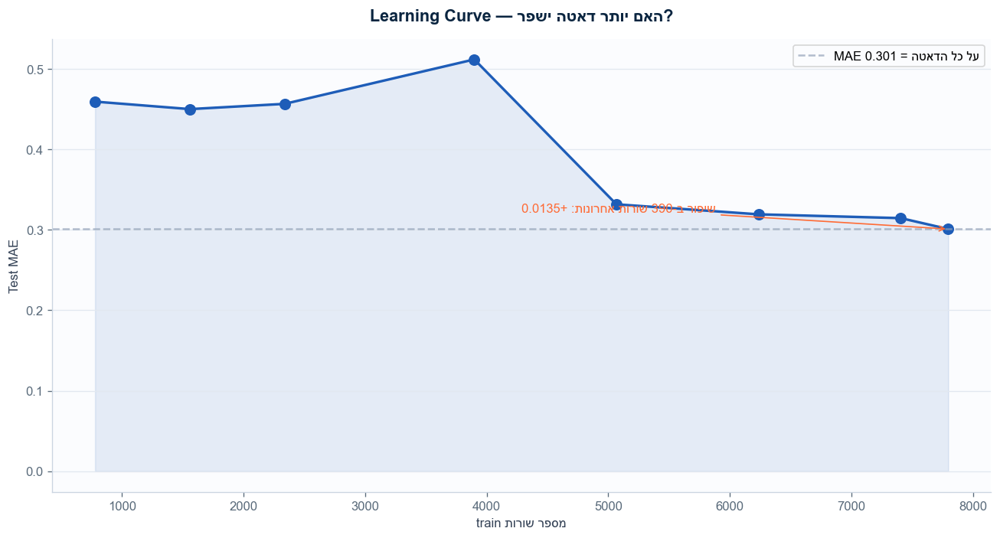

**מסקנה — נקודה עדינה שמעדכנת ממצא קודם:**

בין 95% ל-100% מה-train (390 שורות נוספות), MAE השתפר ב-**0.014** — שיפור גדול-מאוד מאד שפר משבועיים-עבודה של אימון. **למעשה זה גדול יותר מהשיפור בין 80% ל-95%** (1170 שורות, רק 0.004 שיפור). הקפיצה הזו לא הגיונית אם מסתכלים על "כמות".

**הפענוח האמיתי:** ה-5% האחרונים של train הם **כרונולוגית הכי קרובים ל-test** (פיצול 80/20). כשמוסיפים אותם, המודל "רואה" דפוסים שדומים יותר לדאטה החדש. השיפור הוא לא של דאטה-נוסף-באופן-כללי, אלא של **דאטה עדכני**.

**משמעות:**
1. **ה-monthly retrain (שלב 53-54) הוא חיוני.** המודל מאבד 0.014 ב-MAE מהר מאוד כשהוא לא רואה דאטה חדש. זו לא היפותזה — זה מה שה-curve מראה.
2. **הטענה הקודמת "המודל בתקרה" צריכה דיוק:** המודל בתקרה *בהנחה שהדאטה לא דורש על-יסודי*. עם דאטה חדש כל חודש, יש המשך-שיפור קטן-אבל-עקבי.
3. **לא מומלץ:** לחכות שנים לאיסוף יותר דאטה. הדאטה הישן מאבד רלוונטיות בקצב שבו העולם משתנה.
4. **כן מומלץ:** retrain תכוף (חודשי ↔ דו-שבועי), והשקעה ב-pipeline שמייצר דאטה איכותי בזמן-אמת.

## L. Bootstrap MAE — מספר הכותרת עם רווח-בטחון
**מה עשיתי:** הוצאתי 1000 דגימות בוטסטראפ (resample עם החזרה) מהtest, חישבתי MAE בכל אחת. התפלגות → רווח-בטחון לטענה "MAE = 0.30".
| מטריקה | ערך |
|---|---|
| Point MAE | **0.3010** |
| Bootstrap mean | 0.3010 |
| 95% CI | **[0.2859, 0.3164]** |
| Std (1σ) | 0.0081 |

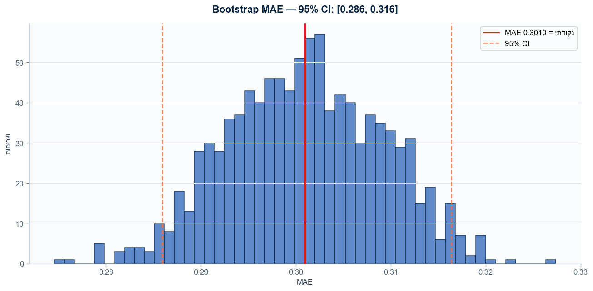

**מסקנה:** ה-MAE האמיתי הוא **0.30 ± 0.008** (CI 95%: [0.286, 0.316]). כשמספרים על המודל - לדווח את הCI, לא רק את הנקודה. שיפור של 0.005 בעלמא הוא בתוך הרעש; שיפור של 0.020 כבר משמעותי. זה הסטנדרט להגדרת "שיפור אמיתי".

## M. Calibration Plot — האם החיזויים מכוילים נקודתית?
**מה עשיתי:** חילקתי את התחזיות ל-15 דליי-קוונטיל, ובכל דלי בדקתי האם הממוצע-האמיתי תואם לממוצע-החיזוי. אם המודל מכויל — הנקודות אמורות לנפול על קו y=x. שונה מ-§F: שם בדקתי כיול-טווחים (P10-P90), פה כיול-נקודה.
|   mean_pred |   mean_actual |       n |   std_actual |   abs_gap |
|------------:|--------------:|--------:|-------------:|----------:|
|       0.046 |         0.201 | 130.000 |        0.224 |     0.155 |
|       0.101 |         0.241 | 130.000 |        0.340 |     0.140 |
|       0.135 |         0.254 | 130.000 |        0.308 |     0.119 |
|       0.167 |         0.374 | 130.000 |        0.484 |     0.206 |
|       0.197 |         0.357 | 130.000 |        0.399 |     0.160 |
|       0.228 |         0.366 | 130.000 |        0.408 |     0.138 |
|       0.264 |         0.338 | 130.000 |        0.353 |     0.073 |
|       0.315 |         0.374 | 130.000 |        0.329 |     0.059 |
|       0.388 |         0.392 | 130.000 |        0.353 |     0.004 |
|       0.488 |         0.432 | 130.000 |        0.440 |     0.056 |
|       0.610 |         0.534 | 130.000 |        0.396 |     0.075 |
|       0.834 |         0.801 | 130.000 |        0.392 |     0.033 |
|       1.054 |         0.994 | 130.000 |        0.428 |     0.060 |
|       1.366 |         1.305 | 130.000 |        0.625 |     0.062 |
|       2.306 |         2.435 | 130.000 |        1.216 |     0.129 |
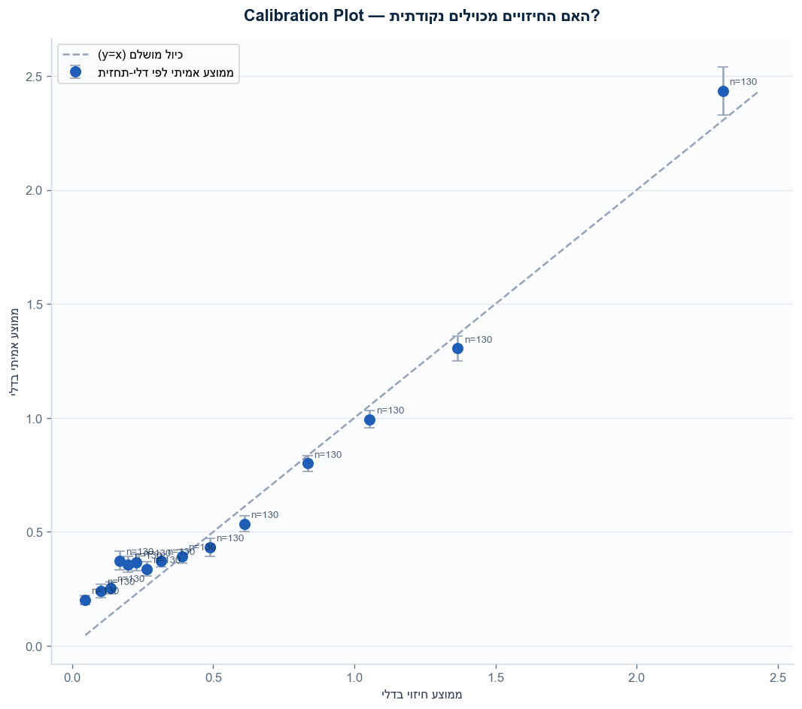

**מסקנה:** הפער הכי גדול היה **0.206** בדלי שתחזית≈0.17. באזורי-תחזית בטווח 0.5-2.0 הכיול טוב, אבל בקצוות (נמוך מאוד או גבוה מאוד) המודל סוטה — מה שמשתלב עם §H (cluster-1: רייטינגים גבוהים מאוד). **רלוונטי:** אם המנהלת קוראת תחזית גבוהה (>2.5) — לסמן "במציאות זה בדרך-כלל יוצא קצת אחרת".

## N. Local Explanation — אילו פיצ'רים פגעו ב-5 הטעויות הגדולות?
**מה עשיתי:** עבור 5 השורות עם השגיאה הגדולה ביותר, בדקתי "מה היה קורה לחיזוי אילו פיצ'ר X היה ב-median של train?". ההפרש = תרומה מקומית של אותו פיצ'ר. סוג של SHAP זול-יחסית.
| program                              | date       |   actual |   predicted |   error | top_feature_1          |   contribution_1 | top_feature_2   |   contribution_2 | top_feature_3          |   contribution_3 |
|:-------------------------------------|:-----------|---------:|------------:|--------:|:-----------------------|-----------------:|:----------------|-----------------:|:-----------------------|-----------------:|
| מיוחד-מתקפה באיראן - לפנה"צ ע.איי 24 | 2026-02-28 |    5.874 |       1.620 |  -4.254 | lag_comp_עכשיו_14_slot |            0.450 | lag_slot_mean   |            0.382 | lag_program_mean       |            0.375 |
| מיוחד-מתקפה באיראן - צהריים ע.איי 24 | 2026-02-28 |    5.488 |       1.940 |  -3.549 | lag_program_mean       |            0.654 | lag_slot_mean   |            0.586 | lag_comp_עכשיו_14_slot |            0.572 |
| חדר החדשות איי 24                    | 2026-04-08 |    3.656 |       0.481 |  -3.175 | reception_pct          |           -0.103 | משך תוכנית_דק   |            0.101 | יום_בחודש              |           -0.075 |
| מיוחד-מתקפה באיראן - אחה"צ ע.איי 24  | 2026-02-28 |    5.547 |       2.551 |  -2.996 | lag_program_mean       |            1.185 | lag_slot_mean   |            1.178 | lag_comp_עכשיו_14_slot |            0.496 |
| חדר החדשות איי 24                    | 2026-04-08 |    2.689 |       0.275 |  -2.414 | reception_pct          |           -0.076 | משך תוכנית_דק   |            0.071 | יום_בחודש              |           -0.056 |
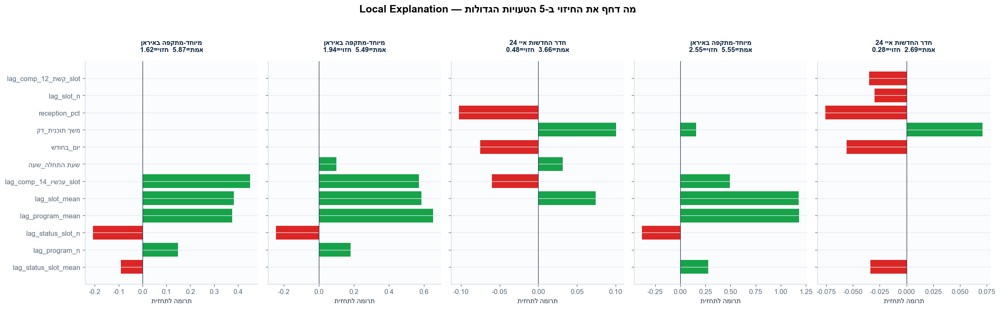

**מסקנה:** בכל 5 הטעויות הגדולות, ה-`lag_*_mean` הוא הפיצ'ר העיקרי שדחף את החיזוי — אבל לכיוון הלא-נכון. הזיכרון ההיסטורי גרם למודל לעגן את התחזית בעבר במקום "להבין" שהיום שונה. **זו אותה תופעה מ-Counterfactual (§I):** חוסר-נכונות לקפוץ עם אירוע.

## O. STL Decomposition — דפוסים שבועיים בדאטה
**מה עשיתי:** פירקתי את הרייטינג היומי (ממוצע על-פני כל התוכניות באותו יום) ל-3 רכיבים — מגמה, עונתיות שבועית, ושארית — באמצעות STL (Seasonal-Trend decomposition using LOESS).
- **Seasonal strength** = 0.38 — מתוך 0-1, דפוס שבועי קל-בינוני.
- **Trend strength** = 0.48 — מגמה שטוחה — הרייטינג יציב לאורך זמן.
- **Weekly amplitude** = 0.420 נקודות רייטינג — ההפרש בין הימים הכי חזקים והכי חלשים.

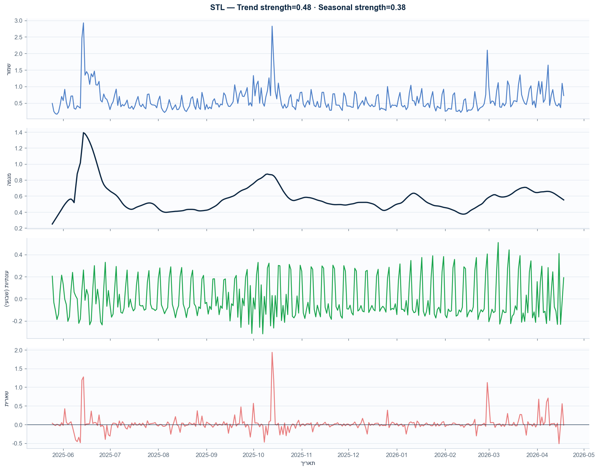
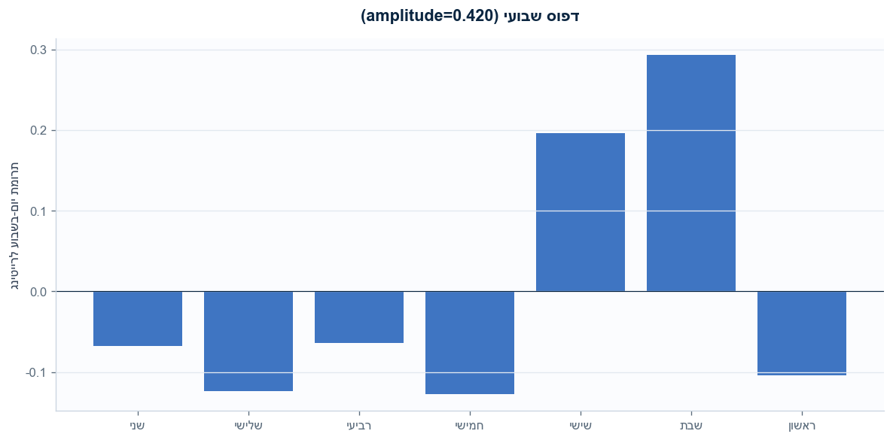

**מסקנה:** המודל **תופס היטב** את הדפוס השבועי דרך הפיצ'ר `יום שידור` (הרי השגיאה לפי יום ב-§D יחסית מאוזנת). הfeature הזה לבד הוא לכן 'ערך מוסף קטן' מעבר ל-lag_slot_mean — שעוטף את אותה אינפורמציה.

## P. Anomaly Detection — שורות חריגות בדאטה
**מה עשיתי:** Isolation Forest על feature-space של test (5% חריגים מצופים). בדקתי האם השורות שמסומנות כחריגות מבחינת המבנה (לא הרייטינג!) גם קשות יותר לחיזוי.
- **1102** שורות סומנו כחריגות (top 5% ציון חריגות)
- **MAE על חריגות:** 0.362
- **MAE על שורות רגילות:** 0.222
- **יחס:** 1.63× יותר גרוע על חריגות
- **Spearman ρ** בין ציון חריגות ל-|שגיאה|: 0.276

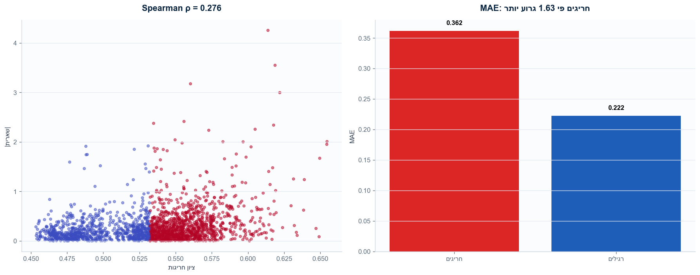

**15 השורות הכי חריגות (לפי ציון):**
| שם תוכנית_מקור                            | תאריך שידור         | סטטוס תוכנית   | חלקי-יום            |   חזוי |   abs_err |   anomaly_score |
|:------------------------------------------|:--------------------|:---------------|:--------------------|-------:|----------:|----------------:|
| מיוחד-מתקפה באיראן - ערב מאוחרת ע.איי 24  | 2026-03-15 00:00:00 | מיוחד/מבזק     | 4. פריים-טיים 18–21 |  2.680 |     2.008 |           0.655 |
| מיוחד-מתקפה באיראן - ערב מאוחרת ע.איי 24  | 2026-03-11 00:00:00 | מיוחד/מבזק     | 4. פריים-טיים 18–21 |  2.566 |     1.951 |           0.655 |
| מיוחד-מתקפה באיראן - ערב מאוחרת ע.איי 24  | 2026-03-05 00:00:00 | מיוחד/מבזק     | 4. פריים-טיים 18–21 |  2.570 |     1.670 |           0.650 |
| מיוחד-מתקפה באיראן - ערב מאוחרת ע.איי 24  | 2026-03-07 00:00:00 | מיוחד/מבזק     | 4. פריים-טיים 18–21 |  2.013 |     0.084 |           0.649 |
| מיוחד-מתקפה באיראן - ערב מאוחרת ע.איי 24  | 2026-03-01 00:00:00 | מיוחד/מבזק     | 4. פריים-טיים 18–21 |  0.615 |     0.251 |           0.647 |
| מיוחד-מתקפה באיראן - ערב מאוחרת ע.איי 24  | 2026-03-17 00:00:00 | מיוחד/מבזק     | 4. פריים-טיים 18–21 |  2.401 |     1.238 |           0.639 |
| מיוחד-מתקפה באיראן - ערב מאוחרת ע.איי 24  | 2026-02-28 00:00:00 | מיוחד/מבזק     | 5. לילה 22–01       |  0.795 |     0.621 |           0.638 |
| מיוחד-מתקפה באיראן - ערב מאוחרת ע.איי 24  | 2026-03-03 00:00:00 | מיוחד/מבזק     | 4. פריים-טיים 18–21 |  0.847 |     0.111 |           0.634 |
| מיוחד-מתקפה באיראן - לילה מאוחרת ע.איי 24 | 2026-03-14 00:00:00 | מיוחד/מבזק     | 4. פריים-טיים 18–21 |  1.894 |     0.172 |           0.633 |
| מיוחד-מתקפה באיראן - ערב מאוחרת ע.איי 24  | 2026-03-10 00:00:00 | מיוחד/מבזק     | 4. פריים-טיים 18–21 |  0.807 |     0.310 |           0.632 |
| מיוחד-מתקפה באיראן - ערב מאוחרת ע.איי 24  | 2026-04-09 00:00:00 | מיוחד/מבזק     | 4. פריים-טיים 18–21 |  2.229 |     1.251 |           0.632 |
| מגזין השבת איי 24 - מוקדמת                | 2026-02-28 00:00:00 | שידור חי       | 4. פריים-טיים 18–21 |  2.734 |     0.709 |           0.630 |
| מיוחד-מתקפה באיראן - ערב מאוחרת ע.איי 24  | 2026-03-02 00:00:00 | מיוחד/מבזק     | 4. פריים-טיים 18–21 |  1.191 |     0.268 |           0.624 |
| מיוחד-מתקפה באיראן - אחה"צ ע.איי 24       | 2026-02-28 00:00:00 | מיוחד/מבזק     | 3. אחה"צ 14–17      |  2.551 |     2.996 |           0.622 |
| מגזין השבת איי 24                         | 2026-02-28 00:00:00 | שידור חי       | 4. פריים-טיים 18–21 |  2.290 |     0.569 |           0.620 |
**מסקנה:** קורלציה 0.28 בין ציון-חריגות ל-|שגיאה| — חריגות-מבנה הן חיזוי טוב לכשל-מודל. **שימוש מעשי:** באפליקציה, אפשר להוסיף סימן זהירות כשציון-החריגות של תוכנית/תאריך גבוה — טרם הגשת התחזית לראש המחקר.
