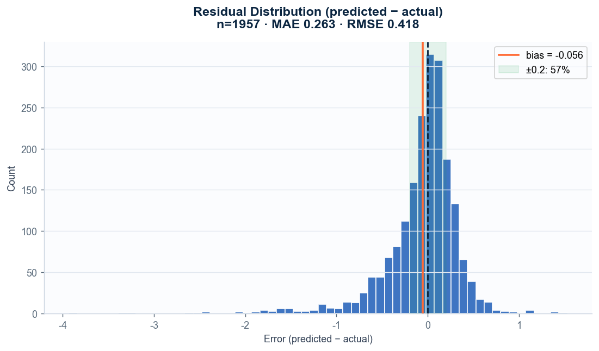
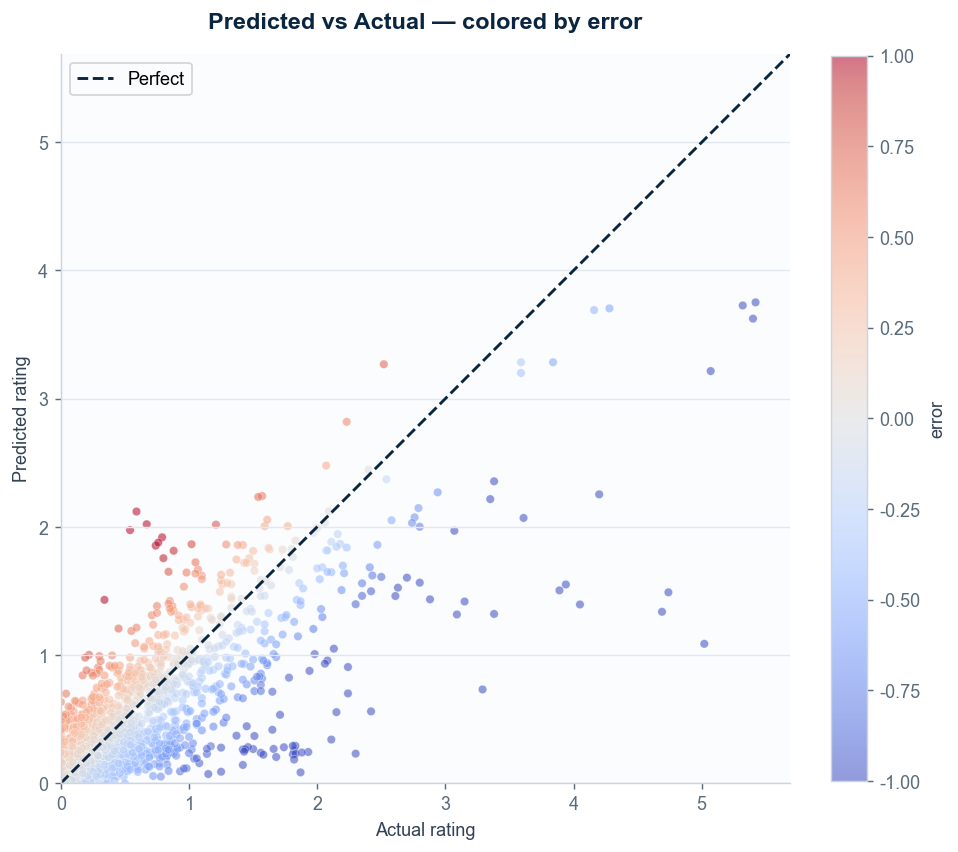
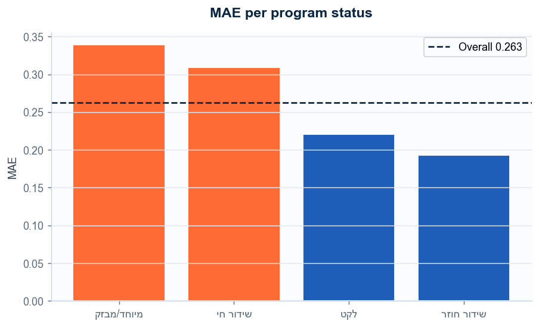
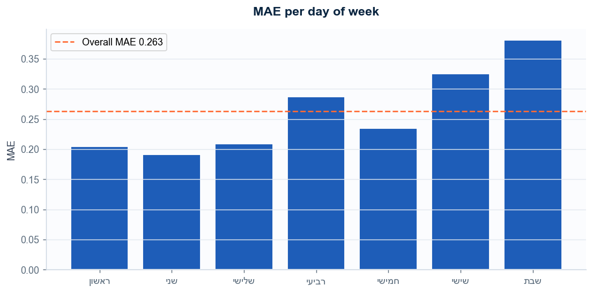
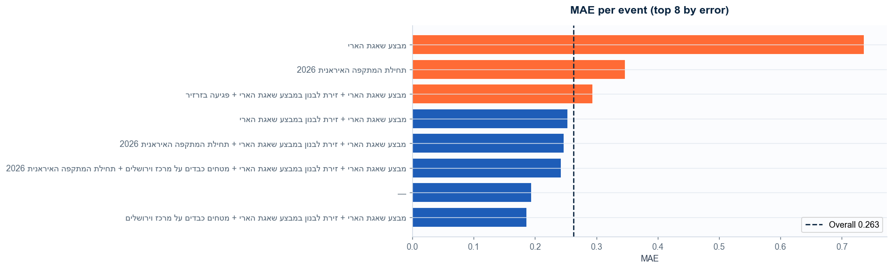
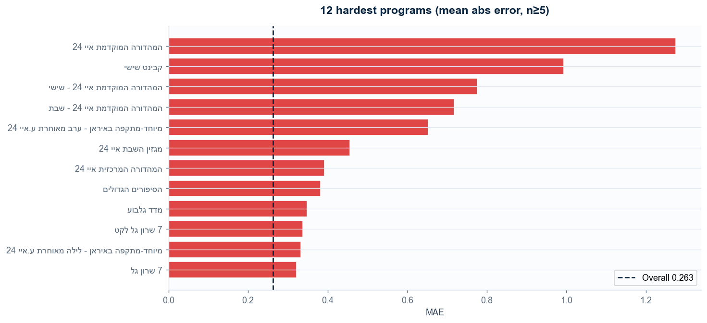
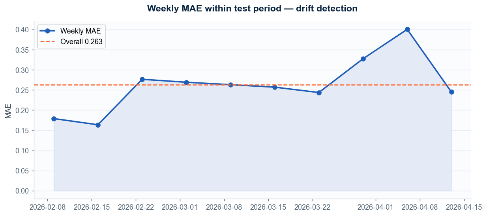
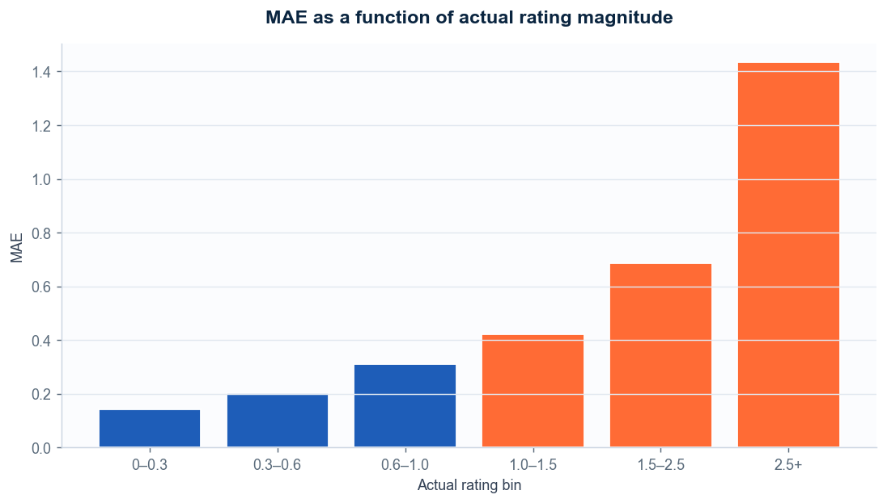

# רטרוספקטיבה — תחזיות מול רייטינג אמיתי

*נוצר: 2026-05-20 · מודל: HistGradientBoosting · n=1957 שידורי סט בחינה (פברואר→אפריל 2026)*

---

## 📊 הביצועים — תמונה כללית

| מטריקה | ערך | פירוש |
|---|---|---|
| **MAE** | **0.263** | טעות ממוצעת ≈ ±6,567 בתי-אב |
| RMSE | 0.418 | מעניש שגיאות חריגות |
| R² | 0.603 | מסביר 60.3% מהשונות |
| Bias (mean error) | -0.056 | under-predict ממוצע |
| בטווח ±0.2 | **57%** | רוב התחזיות קרובות מאוד |
| בטווח ±0.5 | 87% | שגיאות גדולות חריגות |
| P10 / P90 שגיאה | -0.49 / +0.31 | 80% מהשגיאות בתוך הטווח |

---

## 🔍 איפה המודל כשל — פר חתך

### לפי סטטוס תוכנית

| סטטוס      |   n |   mae |   bias |   actual |
|:-----------|----:|------:|-------:|---------:|
| מיוחד/מבזק | 198 | 0.339 | -0.016 |     0.49 |
| שידור חי   | 875 | 0.309 | -0.105 |     0.77 |
| לקט        | 221 | 0.221 | -0.064 |     0.48 |
| שידור חוזר | 663 | 0.193 | -0.002 |     0.3  |

### לפי יום בשבוע

| יום   |   n |   mae |   bias |   actual |
|:------|----:|------:|-------:|---------:|
| שני   | 257 | 0.191 | -0.007 |     0.4  |
| ראשון | 257 | 0.204 |  0.012 |     0.42 |
| שלישי | 283 | 0.209 | -0.03  |     0.42 |
| חמישי | 303 | 0.235 | -0.097 |     0.46 |
| רביעי | 295 | 0.287 | -0.095 |     0.5  |
| שישי  | 296 | 0.325 | -0.111 |     0.76 |
| שבת   | 266 | 0.381 | -0.048 |     0.89 |

### לפי חלק יום

| חלק יום             |   n |   mae |   bias |   actual |
|:--------------------|----:|------:|-------:|---------:|
| 4. פריים-טיים 18–21 | 171 | 0.403 | -0.023 |     1.4  |
| 3. אחה"צ 14–17      | 253 | 0.361 | -0.13  |     0.97 |
| 2. צהריים 10–13     | 369 | 0.285 | -0.167 |     0.54 |
| 5. לילה 22–01       | 333 | 0.25  |  0.064 |     0.44 |
| 1. בוקר 06–09       | 430 | 0.217 | -0.093 |     0.37 |
| 6. לילה מאוחר 02–05 | 401 | 0.18  |  0.017 |     0.21 |

### לפי אירוע מיוחד

| אירוע                                                                                                   |   n |   mae |   bias |   actual |
|:--------------------------------------------------------------------------------------------------------|----:|------:|-------:|---------:|
| מבצע שאגת הארי                                                                                          |  31 | 0.737 | -0.514 |     1.37 |
| תחילת המתקפה האיראנית 2026                                                                              | 457 | 0.347 | -0.147 |     0.69 |
| מבצע שאגת הארי + זירת לבנון במבצע שאגת הארי + פגיעה בזרזיר                                              |  50 | 0.294 | -0.114 |     0.72 |
| מבצע שאגת הארי + זירת לבנון במבצע שאגת הארי                                                             | 340 | 0.254 |  0.075 |     0.5  |
| מבצע שאגת הארי + זירת לבנון במבצע שאגת הארי + תחילת המתקפה האיראנית 2026                                | 387 | 0.247 | -0.114 |     0.61 |
| מבצע שאגת הארי + זירת לבנון במבצע שאגת הארי + מטחים כבדים על מרכז וירושלים + תחילת המתקפה האיראנית 2026 |  35 | 0.243 | -0.069 |     0.49 |
| —                                                                                                       | 635 | 0.194 | -0.005 |     0.39 |
| מבצע שאגת הארי + זירת לבנון במבצע שאגת הארי + מטחים כבדים על מרכז וירושלים                              |  22 | 0.187 |  0.115 |     0.5  |

---

## 🎯 12 התוכניות הקשות ביותר לחיזוי (n≥5)

| תוכנית                                    |   n |   MAE |   Bias |   ר' אמיתי ממוצע |
|:------------------------------------------|----:|------:|-------:|-----------------:|
| המהדורה המוקדמת איי 24                    |   6 | 1.275 | -1.12  |             2.56 |
| קבינט שישי                                |  10 | 0.994 | -0.844 |             4.32 |
| המהדורה המוקדמת איי 24 - שישי             |  10 | 0.776 | -0.342 |             2.59 |
| המהדורה המוקדמת איי 24 - שבת              |  10 | 0.718 | -0.635 |             2.41 |
| מיוחד-מתקפה באיראן - ערב מאוחרת ע.איי 24  |  14 | 0.652 |  0.26  |             0.95 |
| מגזין השבת איי 24                         |  10 | 0.456 | -0.228 |             1.81 |
| המהדורה המרכזית איי 24                    |  48 | 0.391 | -0.033 |             1.34 |
| הסיפורים הגדולים                          |  28 | 0.382 | -0.255 |             0.49 |
| מדד גלבוע                                 |  45 | 0.349 | -0.073 |             1.15 |
| 7 שרון גל לקט                             |  19 | 0.338 | -0.187 |             1.26 |
| מיוחד-מתקפה באיראן - לילה מאוחרת ע.איי 24 |  29 | 0.333 | -0.018 |             0.49 |
| 7 שרון גל                                 |  36 | 0.321 |  0.006 |             1.68 |

---

## 📈 Drift לאורך תקופת הבחינה

האם המודל החזיק את עצמו לאורך הזמן? שגיאה ממוצעת לפי שבוע:

## ⚖️ Heteroscedasticity — האם רייטינגים גבוהים קשים יותר?

---

## 🚨 20 הטעויות הגדולות ביותר (לדיון עם מנהל המחקר)

| תוכנית                                    | יום   | תאריך      | שעה            | סטטוס      | אירוע                                                                    |   אמיתי |   חזוי |   שגיאה |
|:------------------------------------------|:------|:-----------|:---------------|:-----------|:-------------------------------------------------------------------------|--------:|-------:|--------:|
| מיוחד-מתקפה באיראן - לפנה"צ ע.איי 24      | שבת   | 2026-02-28 | 12:00:00       | מיוחד/מבזק | מבצע שאגת הארי                                                           |    5.02 |   1.09 |   -3.93 |
| מיוחד-מתקפה באיראן - צהריים ע.איי 24      | שבת   | 2026-02-28 | 14:00:00       | מיוחד/מבזק | מבצע שאגת הארי                                                           |    4.69 |   1.34 |   -3.35 |
| מיוחד-מתקפה באיראן - אחה"צ ע.איי 24       | שבת   | 2026-02-28 | 16:24:30       | מיוחד/מבזק | מבצע שאגת הארי                                                           |    4.74 |   1.49 |   -3.25 |
| מיוחד-מתקפה באיראן - בוקר ע.איי 24        | שבת   | 2026-02-28 | 08:13:49       | מיוחד/מבזק | מבצע שאגת הארי                                                           |    4.05 |   1.39 |   -2.66 |
| חדר החדשות איי 24                         | רביעי | 2026-04-08 | 14:59:35       | שידור חי   | תחילת המתקפה האיראנית 2026                                               |    3.29 |   0.73 |   -2.56 |
| המהדורה המרכזית איי 24                    | שלישי | 2026-04-07 | 19:50:24       | שידור חי   | תחילת המתקפה האיראנית 2026                                               |    3.94 |   1.55 |   -2.39 |
| המהדורה המוקדמת איי 24                    | שלישי | 2026-04-07 | 17:50:16       | שידור חי   | תחילת המתקפה האיראנית 2026                                               |    3.89 |   1.5  |   -2.39 |
| חדר החדשות איי 24 ש.ח                     | רביעי | 2026-04-08 | 11:30:00       | שידור חוזר | תחילת המתקפה האיראנית 2026                                               |    2.3  |   0.23 |   -2.07 |
| המהדורה המוקדמת איי 24 - שבת              | שבת   | 2026-02-28 | 18:00:00       | שידור חי   | מבצע שאגת הארי                                                           |    3.38 |   1.32 |   -2.06 |
| המהדורה המוקדמת איי 24 - שישי             | שישי  | 2026-03-13 | 17:56:21       | שידור חי   | מבצע שאגת הארי + זירת לבנון במבצע שאגת הארי + פגיעה בזרזיר               |    4.2  |   2.25 |   -1.95 |
| חדר החדשות איי 24                         | רביעי | 2026-04-08 | 12:00:00       | שידור חי   | תחילת המתקפה האיראנית 2026                                               |    2.42 |   0.56 |   -1.86 |
| קבינט שישי                                | שישי  | 2026-03-06 | 19:50:27       | שידור חי   | מבצע שאגת הארי + זירת לבנון במבצע שאגת הארי                              |    5.07 |   3.21 |   -1.86 |
| קבינט שישי לקט                            | רביעי | 2026-04-08 | 04:23:23       | לקט        | תחילת המתקפה האיראנית 2026                                               |    1.87 |   0.08 |   -1.79 |
| קבינט שישי                                | שישי  | 2026-04-03 | 19:51:06       | שידור חי   | תחילת המתקפה האיראנית 2026                                               |    5.4  |   3.62 |   -1.78 |
| המהדורה המוקדמת איי 24                    | חמישי | 2026-04-02 | 17:51:30       | שידור חי   | תחילת המתקפה האיראנית 2026                                               |    3.09 |   1.32 |   -1.77 |
| מיוחד-מתקפה באיראן - לילה מאוחרת ע.איי 24 | שלישי | 2026-04-07 | 1 day, 1:37:30 | מיוחד/מבזק | תחילת המתקפה האיראנית 2026                                               |    2.11 |   0.34 |   -1.77 |
| חדר החדשות איי 24                         | שבת   | 2026-03-07 | 15:04:22       | שידור חי   | מבצע שאגת הארי + זירת לבנון במבצע שאגת הארי                              |    3.15 |   1.42 |   -1.73 |
| חדר החדשות איי 24 ש.ח                     | רביעי | 2026-04-08 | 08:29:31       | שידור חוזר | תחילת המתקפה האיראנית 2026                                               |    1.93 |   0.24 |   -1.69 |
| קבינט שישי                                | שישי  | 2026-03-20 | 19:48:53       | שידור חי   | מבצע שאגת הארי + זירת לבנון במבצע שאגת הארי + תחילת המתקפה האיראנית 2026 |    5.42 |   3.75 |   -1.67 |
| חדר החדשות איי 24                         | רביעי | 2026-04-08 | 09:00:00       | שידור חי   | תחילת המתקפה האיראנית 2026                                               |    1.88 |   0.24 |   -1.64 |

---
## 💡 תובנות מרכזיות

- **המודל לא בהטיה כללית** (bias=-0.056, קרוב ל-0). השגיאות מתקזזות סביב 0 — אין over/under-prediction מערכתי.
- **57%** מהתחזיות נופלות בטווח **±0.2 נקודות** מהאמת — רוב התחזיות שימושיות לתכנון.
- **חתך הכי קשה — סטטוס מיוחד/מבזק** (MAE 0.339) — תוכניות בסטטוס זה דורשות תשומת לב מיוחדת או מודל נפרד.
- **אירוע הכי קשה — מבצע שאגת הארי** (MAE 0.737) — דורש לחזק את תיוג האירועים ולהוסיף features ייעודיים.
- **יום הכי קשה — שבת** (MAE 0.381) — בדקי שמודלת היטב את דפוסי הצפייה ביום זה.
- **20 הטעויות הקיצוניות** מרוכזות לרוב באירועי ברייקינג ביטחוניים — שום מודל היסטורי לא יכול לחזות את עוצמתם.

## 🛠️ מתודה

- **מקור הדאטא:** `predictions_all.xlsx` — 2,008 שורות סט הבחינה (אחרי חיתוך כרונולוגי 2026-02-08)
- **עמודות:** `רייטינג` (אמת) מול `חזוי_13_HistGradientBoosting` (חיזוי)
- **שגיאה** = חיזוי − אמת. אבסולוטית = |חיזוי − אמת|
- **המרה לבתי-אב:** הוכפלה ב-25,000 (גודל פאנל בערך)
- **הסקריפט:** `retrospective_analysis.py` (אידמפוטנטי, ניתן להריץ מחדש כשמגיע דאטא חדש)
